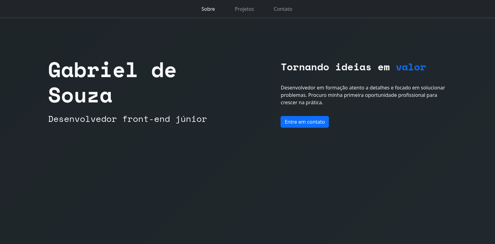

# Portfólio

Este é um portfólio próprio feito para demonstrar meus projetos e habilidades em desenvolvimento web.

## Preview

## Acessando

O site está disponível pelo seguinte link: https://gab-souza-martins.github.io/portifolio-junior/

## Sobre o projeto

Para a criação deste portfólio, foi utilizado Bootstrap e TypeScript. Foi o meu primeiro projeto com Bootstrap, então houve um certo período de aprendizado no início, porém pude ver como ele pode acelerar o processo de desenvolvimento após adquirir experiência.

## Posfácio

Repositório: https://github.com/gab-souza-martins/portifolio-junior

Autor: https://github.com/gab-souza-martins
